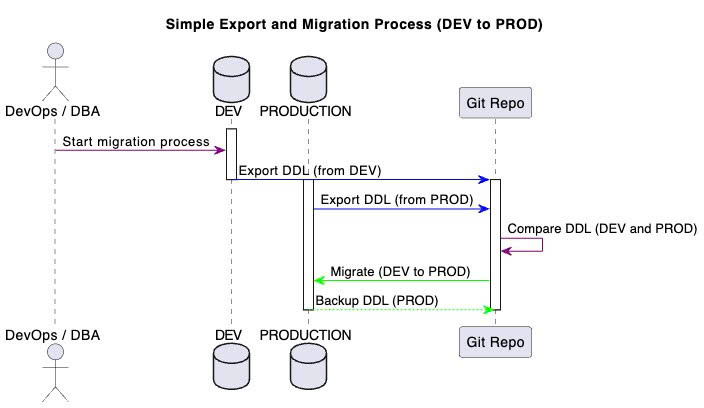

# @anph/core

Database migration and comparison tool by ph4n4n

## Installation

```bash
npm install @anph/core
```

## Usage

### CLI

```bash
# Export database objects
andb export -t tables
andb export -p procedures
andb export -f functions
andb export -tr triggers

# Compare database objects
andb compare -t tables
andb compare -p procedures
andb compare -f functions
andb compare -tr triggers

# Migrate new objects
andb migrate:new -t tables
andb migrate:new -p procedures

# Update existing objects
andb migrate:update -t tables
andb migrate:update -p procedures

# Deprecate objects
andb deprecate -p procedures
andb deprecate -f functions

# Monitor database
andb monitor -p processlist
andb monitor -s status
```

### Programmatic

```javascript
const andb = require('@anph/core');

// Use services
const { service, utils, cli, configs, interfaces } = andb;
```

### Integration Examples

See [examples/](examples/) directory for complete integration examples with basic .env configuration.

## Architecture



*Simple Export and Migration Process (DEV to PROD)*

## Features

- Database object export (tables, procedures, functions, triggers)
- Database comparison between 2 environments each time
- Migration tools for new/updated/removed objects
- Database monitoring
- Multi-environment support, for example (DEV/PROD) or (DEV/STAGE/PROD),...
- Basic .env configuration support

## 📁 Output Folder Structure

### 🗄️ Database Schema Structure
```
📦 <environment>
├── 📂 <schema>
│   ├── 📄 current-ddl
│   ├── ⚙️ functions
│   └── 📊 tables
└── 📂 preflow_40
    ├── 💾 backup
    │   ├── 📅 1_12_2024
    │   │   ├── 🔧 procedures
    │   │   ├── ⚙️ functions
    │   │   └── 🔄 triggers
    │   ├── ⚙️ functions
    │   ├── 🔧 procedures
    │   ├── 📊 tables
    │   └── 🔄 triggers
    ├── 📄 current-ddl
    ├── ⚙️ functions
    ├── 🔧 procedures
    ├── 📊 tables
    └── 🔄 triggers
```

### 🚀 Migration Map Structure
```
📦 map-migrate
└── 📂 <source env>-to-<destination env>  ← <DEV>-to-<PROD>
    └── 📂 <schema>
        ├── ⚙️ functions
        ├── 🔧 procedures
        ├── 📊 tables
        │   └── 🔄 alters
        │       ├── 📋 columns
        │       ├── 🔍 indexes
        │       └── 🗑️ rmv-columns
        └── 🔄 triggers
```

## License
MIT 