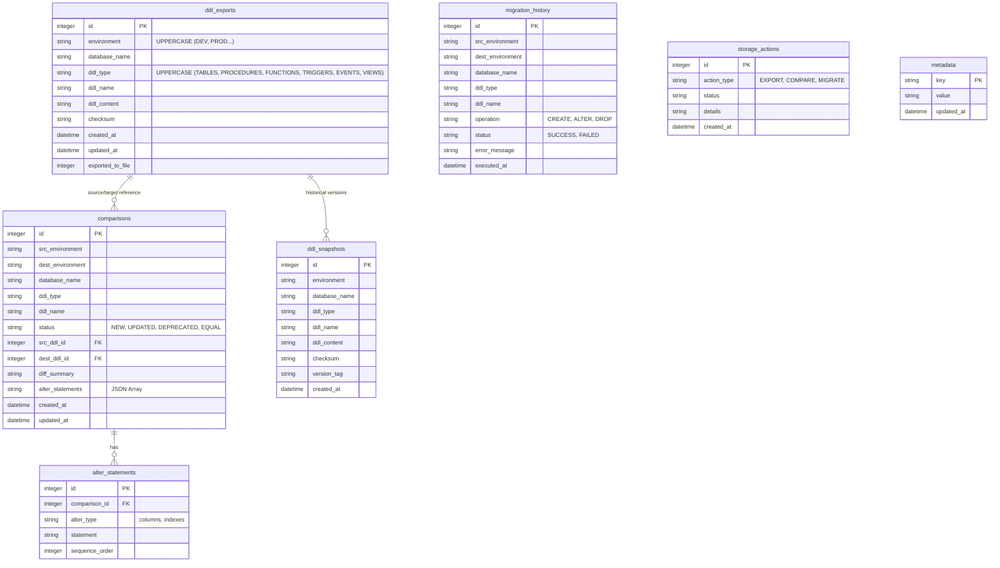

# Database Structure Diagram

This diagram shows the SQLite database schema used for centralized storage in ANDB.

## Layered Architecture

The storage system follows a 3-layer architecture:

1.  **Entity Layer**: Plain JavaScript classes defined in `core/storage/entities/` representing database rows.
2.  **Repository Layer**: Data access logic defined in `core/storage/repositories/`, handling SQL queries and returning Entity instances.
3.  **Service Layer**: `SQLiteStorage` in `core/utils/storage.strategy.js` acts as a facade, coordinating various repositories to provide a unified API.
